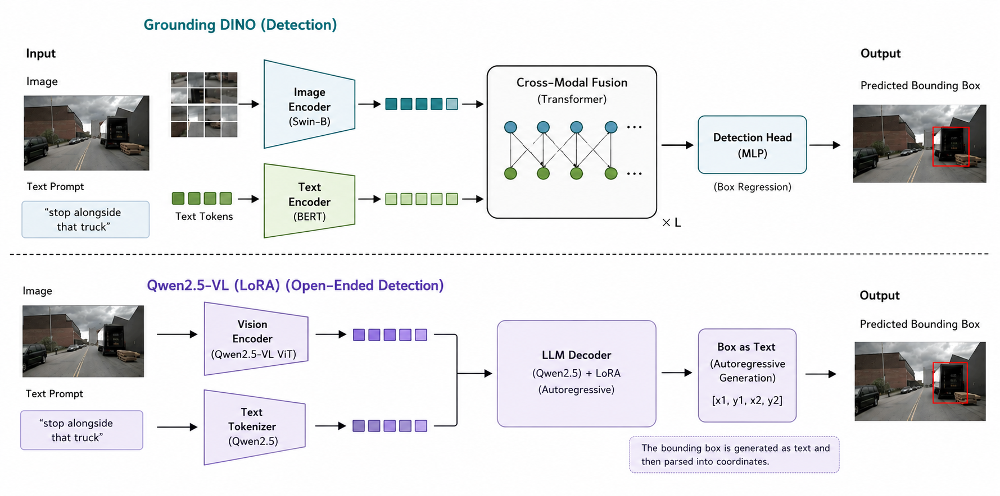
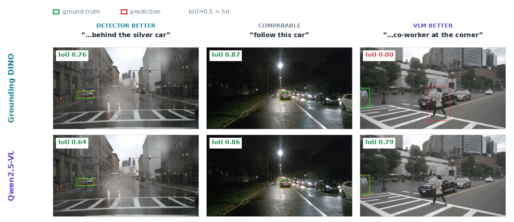
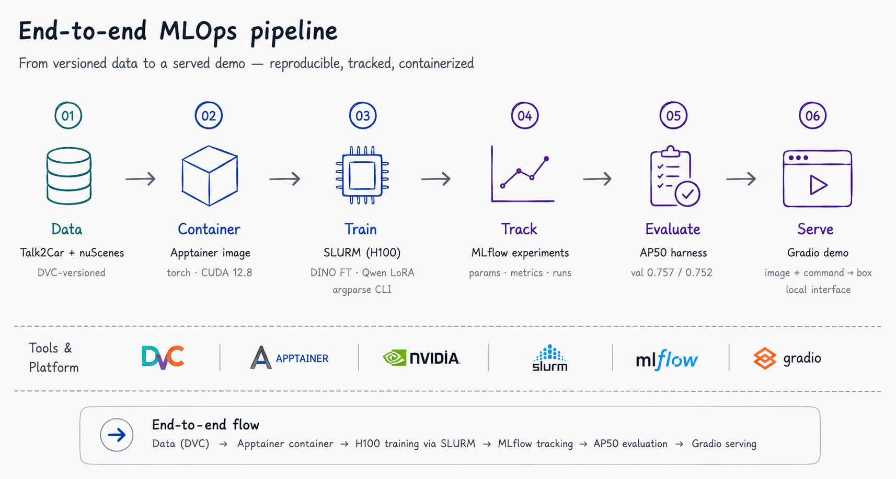

# Drive-VLM

**Language-guided object grounding for autonomous driving.** Given a front-camera image and a
natural-language command, predict the bounding box of the referred object — end-to-end, from
versioned data to two fine-tuned models to a served demo, on the
[Talk2Car](https://talk2car.github.io/) benchmark.



## The task

Talk2Car is built on nuScenes: ~12k commands over ~9.2k front-camera driving images, each command
referring to **one** object with a 2D box. Given the image + a command (e.g. *"stop alongside that
truck"*), output a single `[x1, y1, x2, y2]`.

**Metric:** accuracy @ IoU > 0.5 (Talk2Car's "AP50" — one object per command).

## Results

Two models from opposite paradigms, both fine-tuned into the Talk2Car SOTA band (~0.70–0.76):

| Model | Approach | val acc@0.5 | test acc@0.5 |
|---|---|---|---|
| **Grounding DINO-base** | fine-tuned (frozen backbone) | **0.757** | **0.755** |
| **Qwen2.5-VL-3B** | **LoRA fine-tune** (box-as-text) | **0.752** | **0.745** |
| Grounding DINO-base | zero-shot | 0.514 | — |
| Qwen2.5-VL-3B | zero-shot | 0.498 | — |

Negligible val→test drop (0.002 / 0.007) — the models generalize, they don't overfit.



## Approach

- **Grounding DINO** — a discriminative detector. Fine-tuned the decoder + detection heads with a
  **frozen backbone**; the box comes out as regressed coordinates.
- **Qwen2.5-VL-3B** — an autoregressive VLM. Fine-tuned with **LoRA/PEFT** on the attention layers
  (~15M trainable params), *box-as-text* SFT with answer-only loss masking; the box is **generated
  as text** (`[x1, y1, x2, y2]`) and parsed.
- A single **format-agnostic AP50** harness scores both identically (always top-1 box, since there
  is exactly one referred object).

### What didn't work

- **Unfreezing the Grounding DINO backbone** caused catastrophic forgetting — accuracy collapsed to
  0.37 and clawed back to only 0.58. Keeping the backbone frozen reached 0.757 within an epoch.
- **LoRA on a 3.5k subset (r=16)** plateaued at 0.707. Closing the gap to 0.752 took the full 8.3k
  training set *and* more adapter capacity (r=32) — the box-as-text VLM needed both.
- **Naive zero-shot prompting** left accuracy on the table; a driving-scene grounding prompt recovered
  +16 pts on Qwen, though zero-shot still trailed fine-tuning by ~25 pts.

## MLOps



- **DVC** versions the dataset — pointer files committed to git, image bytes in a remote.
- **MLflow** logs every run (params, metrics, checkpoints); `mlflow_hpc.db` holds all experiments.
- **Apptainer + SLURM** — training ran in an Apptainer container on RWTH HPC (H100) via SLURM.
- **Gradio** serves the fine-tuned checkpoint as an interactive demo.

## Quickstart

```bash
uv sync
uv run pytest                                    # AP50 / IoU metric tests
uv run --extra serving python scripts/demo.py    # Gradio demo (needs checkpoints/gdino-t2c)
```

Evaluate / fine-tune (GPU):

```bash
uv run python scripts/eval_gdino.py --checkpoint checkpoints/gdino-t2c --split test
uv run python scripts/finetune_gdino.py --freeze-backbone --epochs 6      # Grounding DINO
uv run python scripts/finetune_qwen.py --lora-r 32 --epochs 3             # Qwen2.5-VL LoRA
```

## Repository

```text
drive_vlm/
  data.py            Talk2Car → list[Sample(image, command, box)]
  eval.py            IoU + accuracy@0.5 (AP50) metric
scripts/
  finetune_gdino.py  Grounding DINO fine-tuning (frozen backbone, early stopping)
  finetune_qwen.py   Qwen2.5-VL LoRA fine-tuning (box-as-text SFT)
  eval_gdino.py      eval a GDINO checkpoint on any split
  eval_qwen.py       eval Qwen (zero-shot or with a LoRA adapter)
  demo.py            Gradio app on the fine-tuned checkpoint
tests/               pytest for the metric
data/                Talk2Car (DVC-tracked, git-ignored)
```

## Stack

Python 3.12 · uv · PyTorch · HF Transformers · PEFT · DVC · MLflow · Apptainer · SLURM · Gradio

## Dataset & citation

This project uses the [Talk2Car](https://talk2car.github.io/) dataset (built on
[nuScenes](https://www.nuscenes.org/)).

> Deruyttere, T., Vandenhende, S., Grujicic, D., Van Gool, L., & Moens, M.-F. (2019).
> *Talk2Car: Taking Control of Your Self-Driving Car.* In Proceedings of the 2019 Conference on
> Empirical Methods in Natural Language Processing and the 9th International Joint Conference on
> Natural Language Processing (EMNLP-IJCNLP), 2088–2098.

```bibtex
@inproceedings{deruyttere2019talk2car,
  title     = {Talk2Car: Taking Control of Your Self-Driving Car},
  author    = {Deruyttere, Thierry and Vandenhende, Simon and Grujicic, Dusan
               and Van Gool, Luc and Moens, Marie-Francine},
  booktitle = {Proceedings of the 2019 Conference on Empirical Methods in Natural Language
               Processing and the 9th International Joint Conference on Natural Language
               Processing (EMNLP-IJCNLP)},
  pages     = {2088--2098},
  year      = {2019}
}
```
